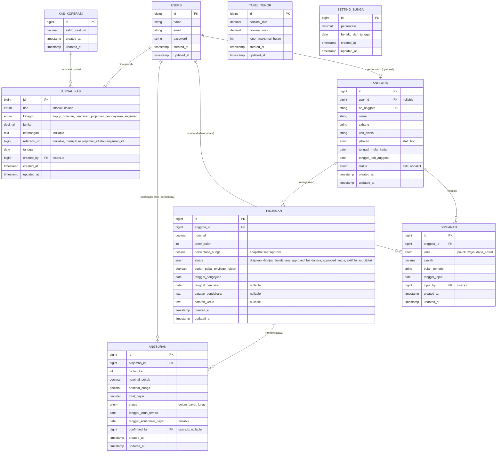

# ERD — Aplikasi Koperasi Simpan Pinjam

**Versi:** 1.0
**Tanggal:** 7 Agustus 2026
**Stack:** Laravel 13 + Inertia + React + MySQL

---

## 1. Diagram Relasi

> Catatan: `TABEL_TENOR` dan `SETTING_BUNGA` adalah master data tanpa relasi FK langsung ke tabel lain — dipakai sebagai referensi saat logic bisnis membuat pinjaman baru.

---

## 2. Detail Tabel

### 2.1 `users`
Akun login untuk role: Admin, Bendahara, Ketua Koperasi, Anggota. Role dikelola lewat package `spatie/laravel-permission` (tabel tambahan otomatis dari package tersebut, tidak digambarkan di ERD ini).

| Kolom | Tipe | Keterangan |
|---|---|---|
| id | bigint (PK) | |
| name | string | |
| email | string | unique |
| password | string | |

### 2.2 `anggota`
Data inti anggota koperasi. `cabang` dan `unit_bisnis` disimpan sebagai string biasa (bukan tabel master terpisah) untuk kesederhanaan.

| Kolom | Tipe | Keterangan |
|---|---|---|
| id | bigint (PK) | |
| user_id | bigint (FK, nullable) | Referensi ke `users.id`, opsional — anggota bisa ada tanpa akun login dulu |
| no_anggota | string (unique) | |
| nama | string | |
| cabang | string | Banjarmasin / Samarinda / Palangka |
| unit_bisnis | string | Sesuai form fisik koperasi |
| jabatan | enum | `staff`, `hod` — menentukan limit pinjaman |
| tanggal_mulai_kerja | date | |
| tanggal_jadi_anggota | date | Acuan hitung senioritas keanggotaan |
| status | enum | `aktif`, `nonaktif` |

### 2.3 `simpanan`
Dicatat manual oleh Bendahara. Satu anggota bisa punya banyak baris simpanan (per jenis, per bulan).

| Kolom | Tipe | Keterangan |
|---|---|---|
| id | bigint (PK) | |
| anggota_id | bigint (FK) | |
| jenis | enum | `pokok` (sekali di awal), `wajib` (rutin bulanan), `dana_sosial` |
| jumlah | decimal(15,2) | |
| bulan_periode | string | Format `YYYY-MM` |
| tanggal_input | date | |
| input_by | bigint (FK) | Bendahara yang menginput, referensi `users.id` |

### 2.4 `pinjaman`
`persentase_bunga` disimpan sebagai snapshot saat pengajuan dibuat/disetujui — tidak berubah meski `setting_bunga` di kemudian hari berubah.

| Kolom | Tipe | Keterangan |
|---|---|---|
| id | bigint (PK) | |
| anggota_id | bigint (FK) | |
| nominal | decimal(15,2) | |
| tenor_bulan | int | Dipilih bebas oleh anggota, dibatasi `tabel_tenor` |
| persentase_bunga | decimal(5,2) | Snapshot, contoh `1.00` untuk 1% |
| status | enum | `diajukan` → `ditinjau_bendahara` → `approved_bendahara` → `approved_ketua` → `aktif` → `lunas` (atau `ditolak` di tahap manapun) |
| sudah_pakai_privilege_reloan | boolean | Menandai apakah pinjaman ini dibuat dengan memanfaatkan privilege "sisa 2x angsuran" |
| tanggal_pengajuan | date | |
| tanggal_pencairan | date (nullable) | |
| catatan_bendahara | text (nullable) | |
| catatan_ketua | text (nullable) | |

### 2.5 `angsuran`
Jadwal cicilan, di-generate otomatis saat pinjaman `approved_ketua` (jadi `aktif`). Bunga dihitung menurun (declining balance) dari sisa pokok.

| Kolom | Tipe | Keterangan |
|---|---|---|
| id | bigint (PK) | |
| pinjaman_id | bigint (FK) | |
| cicilan_ke | int | Urutan cicilan (1, 2, 3, dst) |
| nominal_pokok | decimal(15,2) | |
| nominal_bunga | decimal(15,2) | 1% dari sisa pokok bulan berjalan |
| total_bayar | decimal(15,2) | pokok + bunga |
| status | enum | `belum_bayar`, `lunas` |
| tanggal_jatuh_tempo | date | |
| tanggal_konfirmasi_bayar | date (nullable) | |
| confirmed_by | bigint (FK, nullable) | Bendahara yang konfirmasi, referensi `users.id` |

### 2.6 `tabel_tenor`
Master data batas tenor maksimal berdasarkan rentang nominal pinjaman.

| Kolom | Tipe | Keterangan |
|---|---|---|
| id | bigint (PK) | |
| nominal_min | decimal(15,2) | |
| nominal_max | decimal(15,2) | |
| tenor_maksimal_bulan | int | |

**Contoh data (masih perlu dilengkapi):**
| nominal_min | nominal_max | tenor_maksimal_bulan |
|---|---|---|
| 0 | 1.000.000 | 3 |
| 1.000.001 | 2.000.000 | 4 |
| ... | ... | ... |
| 4.000.001 | 5.000.000 | 12 |

### 2.7 `setting_bunga`
Master data persentase bunga aktif. Perubahan di sini **tidak memengaruhi** pinjaman yang sudah berjalan (lihat `pinjaman.persentase_bunga`).

| Kolom | Tipe | Keterangan |
|---|---|---|
| id | bigint (PK) | |
| persentase | decimal(5,2) | |
| berlaku_dari_tanggal | date | |

### 2.8 `kas_koperasi`
Saldo dana pinjaman koperasi, digabung untuk semua cabang (1 baris data / row tunggal).

| Kolom | Tipe | Keterangan |
|---|---|---|
| id | bigint (PK) | |
| saldo_saat_ini | decimal(15,2) | |

### 2.9 `jurnal_kas`
Buku besar mutasi kas. `referensi_id` merujuk ke `pinjaman.id` atau `angsuran.id` tergantung `kategori`, tanpa foreign key constraint formal (pola sederhana, bisa diubah ke polymorphic relation kalau diperlukan nanti).

| Kolom | Tipe | Keterangan |
|---|---|---|
| id | bigint (PK) | |
| tipe | enum | `masuk`, `keluar` |
| kategori | enum | `topup_bulanan`, `pencairan_pinjaman`, `pembayaran_angsuran` |
| jumlah | decimal(15,2) | |
| keterangan | text (nullable) | |
| referensi_id | bigint (nullable) | |
| tanggal | date | |
| created_by | bigint (FK) | Referensi `users.id` |

---

## 3. Aturan Bisnis Terkait Data (Ringkasan)

- **Limit pinjaman** ditentukan kombinasi `jabatan` (staff 7jt / hod 10jt) dan lama keanggotaan dari `tanggal_jadi_anggota` (< 1 tahun maks 1jt, ≥ 5 tahun bisa > 10jt — angka pasti menyusul).
- **Privilege reloan**: anggota dengan pinjaman aktif tersisa 2x angsuran boleh mengajukan pinjaman baru — tapi hanya berlaku **sekali per siklus pinjaman** (ditandai `sudah_pakai_privilege_reloan`). Anggota < 1 tahun tidak dapat privilege ini, wajib lunas dulu.
- **Approval berjenjang**: Bendahara (tinjau + approval tahap 1) → Ketua Koperasi (approval tahap 2/final).
- **Bunga menurun (declining balance)**: dihitung dari sisa pokok tiap bulan, persentase di-snapshot saat pinjaman dibuat.
- **Tidak ada batas waktu pending** untuk status approval.
- **Simpanan wajib** diinput manual oleh Bendahara per bulan (tidak ada generate otomatis).
- **Kas koperasi** digabung semua cabang, ditambah manual tiap awal bulan (topup dari keuntungan perusahaan yang disisihkan).

---

## 4. Rencana Dummy Data (Testing)

| Skenario Anggota | Lama Keanggotaan | Skenario Pinjaman |
|---|---|---|
| Anggota baru | < 1 tahun | Pinjaman baru diajukan (belum direview) |
| Anggota sedang | 1–5 tahun | Pinjaman aktif, sebagian angsuran lunas |
| Anggota lama | ≥ 5 tahun | Pinjaman lunas semua (histori) |
| Anggota lama | ≥ 5 tahun | Pinjaman aktif, sisa 2 kali angsuran (test privilege reloan) |
